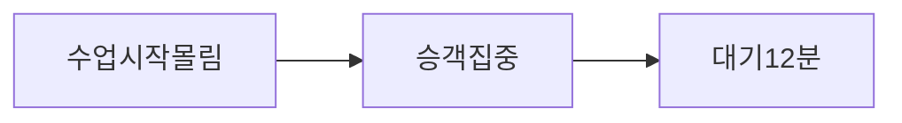

# mermaid

- 흐름과 관계는 mermaid 코드 블록으로 그린다. GitHub, Notion, Obsidian 에서 바로 그림이 된다.
- 상자 하나에 낱말 다섯 개를 넘기지 않는다.
- 그림 아래에 한 문장으로 무엇을 보여 주는지 쓴다.

## 보기

```mermaid
flowchart LR
  수업시작몰림 --> 승객집중 --> 대기12분
```
